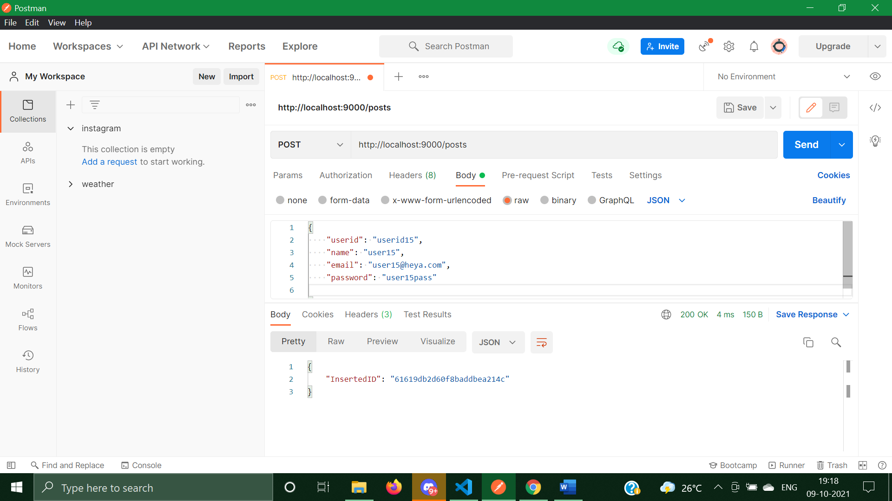
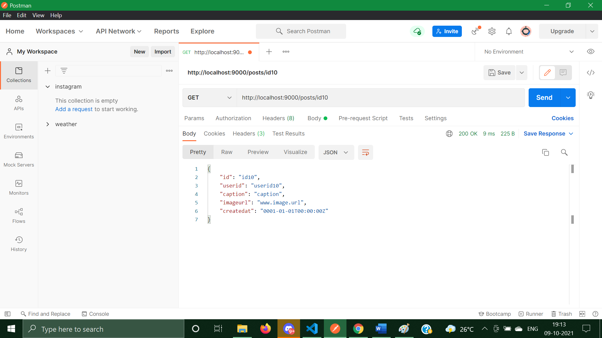
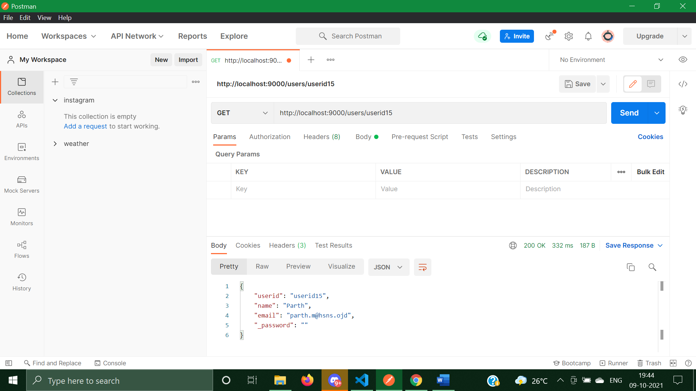
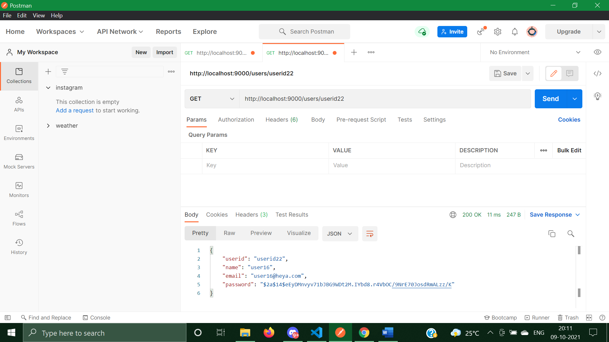

# Instagram Backend API

[](https://forthebadge.com)
[](https://forthebadge.com)

<br>

An Instagram Backend API made using GO-lang and mongoDB. Tested using POSTMAN. API hosted locally on URL<br>

```ruby
localhost:9000/
```
Features:<br>

- [X] Creating a new Post
```ruby
localhost:9000/posts/
```


- [X] Creating a new User
```ruby
localhost:9000/User/
```


Post<br>
JSON Format:<br>

```ruby
{
    "id": "id4",
    "userid": "userid1",
    "caption": "Parth4",
    "imageurl": "Mahadik",
    "createdat": "0001-01-01T00:00:00Z"
}
```
User<br>
JSON Format:<br>

```ruby
{
    "userid": "userid15",
    "name": "Parth",
    "email": "parth.m@hsns.ojd",
    "password": "pass"
}
```
- [X] Retriving post using Post ID<br>
```ruby
localhost:9000/posts/<id>
```


- [X] Retriving user using User ID<br>
```ruby
localhost:9000/users/<userid>
```


- [X] Retriving entire list of Posts for a User using User ID<br>
```ruby
localhost:9000/users/posts/<userid>
```

